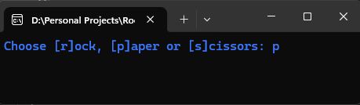
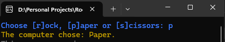
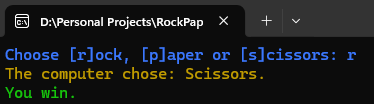
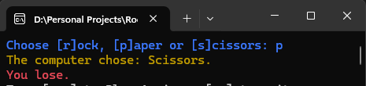
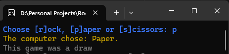
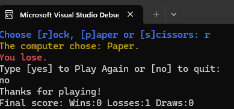

# Rock-Paper-Scissors Game

A simple console-based Rock-Paper-Scissors game written in C#.  


This project lets the user play the classic game against the computer, tracks wins, losses, and draws, and allows replaying multiple rounds.

---

## Project Goals

The main goals of this project are:

- Implement a **Rock-Paper-Scissors game** in C# for the console.
- Allow **user input** and **randomized computer moves**.
- Keep track of **wins, losses, and draws** using counters.
- Give the player the option to **play multiple rounds**.
- Improve **program readability** and **user interaction** with colored console outputs.
  
This project solves the problem of creating a fun, interactive game that demonstrates **basic programming concepts** like:
- Conditional statements (`if-else`)
- Loops (`do-while`)
- Random number generation (`Random`)
- Variables and counters
- Console color management

---

## Solution

To solve the problem, the project uses:

- **C# Console Application** – The game runs in the console.
- **Random Number Generation** – To simulate the computer’s moves.
- **Conditional Logic** – To determine the game result (win, lose, draw).
- **Counters** – To track wins, losses, and draws.
- **Console Colors** – To visually distinguish game outcomes.
- **Looping** – Using `do-while` to allow multiple rounds.

**Algorithm:**
1. Ask the user to choose Rock, Paper, or Scissors.
2. Generate a random move for the computer.
3. Compare moves and determine the winner.
4. Update counters for wins, losses, or draws.
5. Display the result and current statistics.
6. Ask if the user wants to play again. Repeat if yes.

**Technologies and Tools:**
- C# 12.0 (Console Application)
- Visual Studio / Visual Studio Code
- GitHub (for version control)
- Markdown (for README)

---

## Source Code

You can find the full source code [here]([https://github.com/yourusername/rock-paper-scissors](https://github.com/MarkataaBG04/RockPaperScissorsGame/blob/main/RockPaperScissors.cs)).

---

## Screenshots

**Game Start:**



**Computer choose:**



**After a Win:**



**After a loss:**



**After a Draw:**



**Statistics:**



---

## Live Demo

You can run the project directly by cloning the repository and opening it in Visual Studio or VS Code:

```bash
git clone https://github.com/MarkataaBG04/RockPaperScissorsGame.git
